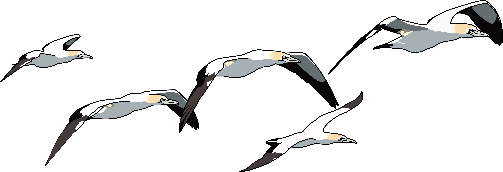
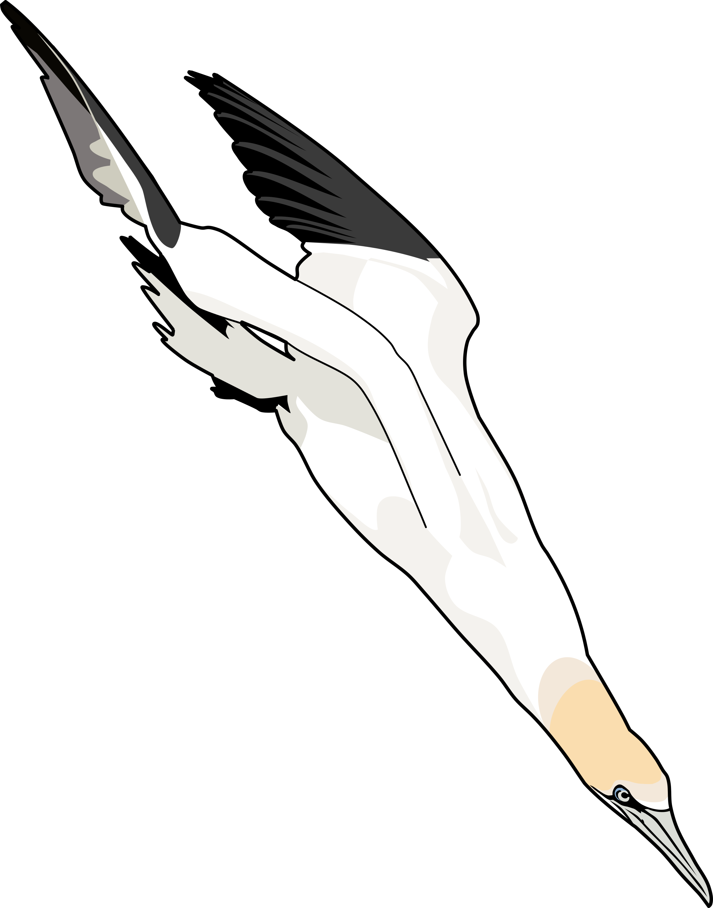

# Competition and facilitation influence central place foraging ecology in a colonial marine predator
A repo containing data and reproducible code for the manuscript "Langley, L.P., Cox, S.L., Patrick, S.C., Votier S.C. (2024). Competition and facilitation influence central place foraging ecology in a colonial marine predator."

## Authors

- Liam P Langley:  
- Sam L. Cox:
- Sam C. Patrick
- Stephen C. Votier

## Usage
### Background
All R code was written and using on R version 4.0.3. 
Some elements of the code use packages that have since been deprecated (e.g. the ggsn package to add scale bars to maps in Figure 4) and may not run on more recent versions of R.

### Data
We provide the following bio-logging data collected from adult Gannets breeding at Grassholm collected between 2011 and 2013:

 &nbsp;&nbsp;&nbsp;&nbsp;&nbsp;
 &nbsp;&nbsp;&nbsp;&nbsp;&nbsp;

- `Data/Dive_Data`: A folder containing the following data files relating to gannet dive behaviour, originally collected by Sam Cox and analysed as part of Cox et al. 2016 ((https://doi.org/10.1098/rsos.160317)):
  1. `GannetDiveSummary_Oceanogrpahy_AllYears`: Dive information extracted from temperature depth recorders including dive depth and duration, annotated with location information from GPS data.
  2. `GannetGPS_DiveEvent_OneMinute_Oceanography_AllYears.csv`: One minute resolution GPS data from all tracked gannets annotated with dive event information (dive event 1 vs. 0) from temperature depth recorders.
  3. `GannetSummaryStatistics_CompleteTrips_2012_2013.csv`: Summary statistics (trip length, duration, max distance etc) calculated by Cox et al. for all complete trips cfrom tagged adult gannets in 2012 and 2013, used here to identify complete vs. incomplete trips. 

- `Data/Camera_Data`: A folder containing GPS data from 8 adult gannets equipped with co-deployed cameras in 2011. GPS data is annotated with behavioural classifications from Hidden Markov Models by Clark et al. 2021 (https://doi.org/10.3354/meps13636) and sociality data (conspecifics present or absent) extracted from video stills by SCV.

### R scripts
The R scripts provided here can be used to reproduce all analyses and figures from the paper. Scripts are numbered sequentially for analysis on the Camera and Dive data respectively and are intended to be run in order.
1. `Camera_data_step01_clean_data.R`: Read in GPS data annotated with social information extracted from camera loggers and clean for further analysis.
2. `Camera_data_step02.R`: Create population and individual level summaries of the social behaviours during gannet foraging trips.
3. `Camera_data_step03_create_fig4.R`: Create manuscript figure 4 mapping social behaviours across gannet foraging trips.
4. `Camera_data_step04_social_foraging_models.R`: Model social foraging propensity as a function of distance from the colony using GAMMs and create figure 5 for the manuscript.
5. `Dive_data_step01_clean_and_annotate_data.R`: Clean and process GPS data annotated with dive information extracted from temperature depth records and annotate with trip metric information.
6. `Dive_data_step02_create_data_breakdown.R`: Create a year-level summary of dive information.
7. `Dive_data_step03_create_and_map_dive_kernels.R`: Create spatial kernels of gannet dive locations and save out the kernel files.
8. `Dive_data_step04_create_fig1.R`: Create figure 1 for the manuscript.
9. `Dive_data_step05_create_fig2.R`: Create figure 2 for the manuscript.
10. `Dive_data_step06_dive_propensity_modelling.R`: Model dive propensity as a function of distance from the colony using GAMMs and create figure 3 for the manuscript.
11. `Dive_data_step_07_dive_characteristics_modelling_GAMMs.R`: Model dive depth and duration as a function of distance from the colony using GAMMs.
12. `Dive_data_step_08_dive_characteristics_modelling_LMMs.R`: Model dive depth and duration as a function of distance from the colony using LMMs.

## Acknowledgements
Thanks to the RSPB for permission to study gannets on Grassholm and Emma Wood for providing gannet illustrations. This work was supported by the Natural Environment Research Council (NERC; NE/J500380/1; NE/H007466/1), Natural Resources Wales and the Association for the Study of Animal Behaviour. 
